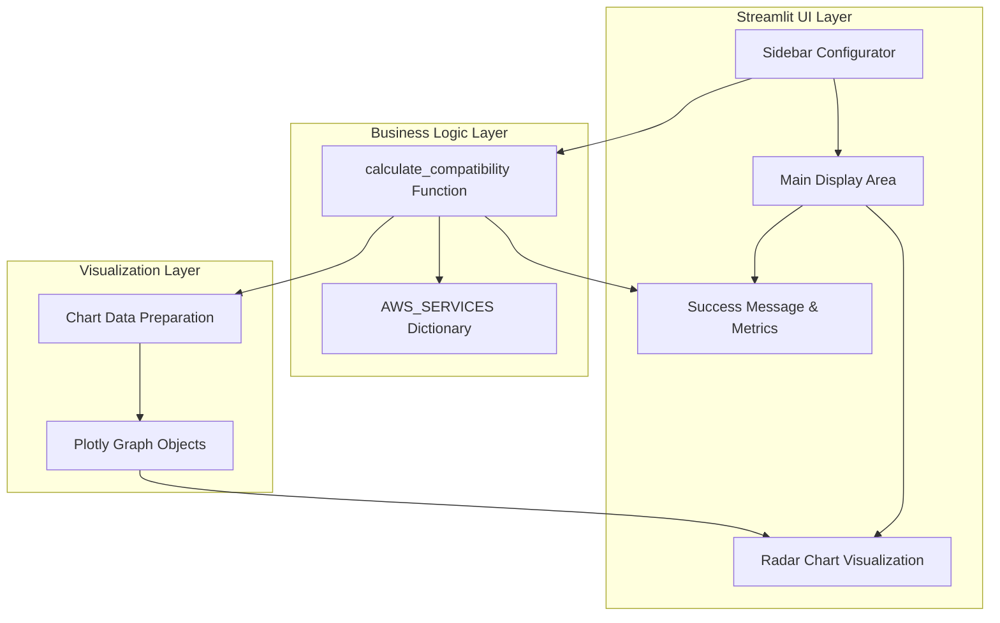

# Design Document

## Overview

The AWS Compute Referee is a Streamlit-based decision support system that helps developers select the optimal AWS compute service from four options: EC2, Lambda, Fargate, and App Runner. The application uses a weighted scoring algorithm to match user priorities against service characteristics, providing both numerical recommendations and visual comparisons through radar charts.

The system follows a clean architecture pattern with clear separation between the user interface (Streamlit components), business logic (pure Python functions), and data layer (service characteristics dictionary). This design ensures testability, maintainability, and extensibility.

## Architecture



The application follows a reactive architecture where user input changes trigger immediate recalculation and display updates. The Streamlit framework handles the reactive updates automatically when session state changes.

## Components and Interfaces

### Sidebar Configurator Component

**Purpose**: Captures user priorities through interactive sliders
**Interface**:
```python
def create_sidebar_configurator() -> Dict[str, int]:
    """
    Creates sidebar sliders for user priority input
    Returns: Dictionary with priority weights (0-100)
    """
```

**Implementation Details**:
- Uses `st.sidebar.slider()` for each of the four priority dimensions
- Returns a dictionary with keys: 'operational_overhead', 'cost_sensitivity', 'workload_consistency', 'setup_speed'
- Each slider has range 0-100 with appropriate default values
- Includes descriptive labels and help text for user guidance

### Logic Engine Component

**Purpose**: Core business logic for service compatibility calculation
**Interface**:
```python
def calculate_compatibility(user_weights: Dict[str, int]) -> Tuple[str, float, Dict[str, float]]:
    """
    Calculates compatibility scores for all AWS services
    Args: user_weights - Dictionary of user priority weights
    Returns: Tuple of (winner_service_name, winner_score, all_scores)
    """
```

**Algorithm**: Weighted Euclidean distance calculation
1. For each service, calculate the distance between user weights and service characteristics
2. Use formula: `distance = sqrt(sum((user_weight - service_value)^2 * weight_factor))`
3. Convert distance to compatibility score: `score = 100 - (distance / max_possible_distance * 100)`
4. Return service with highest compatibility score

### AWS Services Data Model

**Structure**:
```python
AWS_SERVICES = {
    "EC2": {
        "operational_overhead": 20,  # High operational overhead (custom management)
        "cost_sensitivity": 60,     # Moderate cost efficiency
        "workload_consistency": 80,  # Excellent for steady workloads
        "setup_speed": 30           # Slower setup time
    },
    "Lambda": {
        "operational_overhead": 90,  # Very low operational overhead (fully managed)
        "cost_sensitivity": 85,     # Excellent cost efficiency for sporadic use
        "workload_consistency": 30,  # Better for spiky/event-driven workloads
        "setup_speed": 95           # Very fast setup
    },
    "Fargate": {
        "operational_overhead": 75,  # Low operational overhead (managed containers)
        "cost_sensitivity": 70,     # Good cost efficiency
        "workload_consistency": 70,  # Good for both steady and variable workloads
        "setup_speed": 60           # Moderate setup time
    },
    "App Runner": {
        "operational_overhead": 85,  # Very low operational overhead
        "cost_sensitivity": 75,     # Good cost efficiency
        "workload_consistency": 60,  # Moderate workload flexibility
        "setup_speed": 90           # Very fast setup
    }
}
```

**Rationale for Values**:
- **EC2**: High control but high operational overhead, good for steady workloads, slower setup
- **Lambda**: Serverless with minimal ops, excellent for spiky workloads, instant deployment
- **Fargate**: Managed containers with moderate overhead, balanced for various workloads
- **App Runner**: Fully managed with minimal setup, optimized for web applications

### Visualization Engine Component

**Purpose**: Creates and displays radar chart comparisons
**Interface**:
```python
def create_radar_chart(user_weights: Dict[str, int], winner_service: str) -> go.Figure:
    """
    Creates radar chart comparing user ideal vs winner characteristics
    Args: user_weights, winner_service name
    Returns: Plotly Figure object
    """
```

**Implementation**:
- Uses `plotly.graph_objects.Scatterpolar` for radar chart creation
- Two traces: "User's Ideal" (user weights) and "Winner's Stats" (service characteristics)
- Radial axes for each priority dimension with 0-100 scale
- Filled areas for better visual comparison
- Responsive design with appropriate colors and styling

## Data Models

### User Weights Model
```python
UserWeights = TypedDict('UserWeights', {
    'operational_overhead': int,  # 0-100, higher = prefer managed services
    'cost_sensitivity': int,      # 0-100, higher = prefer cost-effective options
    'workload_consistency': int,  # 0-100, higher = prefer steady workload optimization
    'setup_speed': int           # 0-100, higher = prefer fast deployment
})
```

### Service Characteristics Model
```python
ServiceCharacteristics = TypedDict('ServiceCharacteristics', {
    'operational_overhead': int,  # 0-100, service's management level
    'cost_sensitivity': int,      # 0-100, service's cost efficiency
    'workload_consistency': int,  # 0-100, service's steady workload optimization
    'setup_speed': int           # 0-100, service's deployment speed
})
```

### Compatibility Result Model
```python
CompatibilityResult = TypedDict('CompatibilityResult', {
    'winner': str,                    # Name of recommended service
    'winner_score': float,            # Compatibility score (0-100)
    'all_scores': Dict[str, float]    # Scores for all services
})
```

## Correctness Properties

*A property is a characteristic or behavior that should hold true across all valid executions of a system—essentially, a formal statement about what the system should do. Properties serve as the bridge between human-readable specifications and machine-verifiable correctness guarantees.*

Based on the prework analysis, I've identified several properties that can be tested across all inputs, while noting that some requirements are better tested as specific examples. Here are the key properties that should hold universally:

### Property Reflection

After reviewing all testable criteria from the prework analysis, I've identified several areas where properties can be consolidated:
- Properties 1.2 and 2.4 both test value ranges (0-100) and can be combined into a comprehensive input validation property
- Properties 3.2 and 3.3 both test the calculation algorithm and can be combined into a single comprehensive scoring property
- Properties 5.4 and 5.5 both test chart reactivity and can be combined into a single chart update property
- Properties 7.1 and 7.4 both test performance timing and can be combined into a single performance property

### Core Properties

**Property 1: Input validation and range compliance**
*For any* user input values and service attribute values, all numerical values should be within the range 0-100 inclusive
**Validates: Requirements 1.2, 2.4**

**Property 2: Service data structure consistency**
*For any* service in the AWS_SERVICES dictionary, it should contain all four required priority dimensions with numerical values
**Validates: Requirements 2.3**

**Property 3: Data immutability during execution**
*For any* sequence of function calls during application runtime, the AWS_SERVICES dictionary should remain unchanged
**Validates: Requirements 2.5**

**Property 4: Compatibility calculation correctness**
*For any* valid user weights input, the calculate_compatibility function should return the service with the highest compatibility score, and all scores should be valid numbers between 0-100
**Validates: Requirements 3.2, 3.3**

**Property 5: Performance requirements**
*For any* valid input, the calculate_compatibility function should complete within 100 milliseconds
**Validates: Requirements 3.5**

**Property 6: Reactive display updates**
*For any* change in user weights or winner determination, all display elements (winner display and radar chart) should update to reflect the new state
**Validates: Requirements 1.7, 4.4**

**Property 7: Chart data reactivity**
*For any* change in user weights or winner selection, the radar chart should update both the "User's Ideal" and "Winner's Stats" series appropriately
**Validates: Requirements 5.4, 5.5**

**Property 8: System responsiveness**
*For any* user interaction (slider changes, rapid movements), the system should respond without errors and maintain performance within specified time limits
**Validates: Requirements 7.1, 7.4, 7.5**

Now I'll analyze the acceptance criteria to determine which can be tested as properties:

<function_calls>
<invoke name="prework">
<parameter name="featureName">aws-compute-referee

## Error Handling

### Input Validation
- **Slider Values**: Streamlit sliders automatically constrain values to the specified range (0-100), providing built-in validation
- **Dictionary Access**: Use `.get()` methods with default values when accessing service attributes to prevent KeyError exceptions
- **Type Checking**: Implement runtime type checking for function parameters using isinstance() checks

### Calculation Errors
- **Division by Zero**: Handle edge cases where all user weights are zero by providing default behavior
- **Invalid Scores**: Ensure compatibility scores are always finite numbers; replace NaN or infinite values with 0
- **Empty Results**: Handle cases where no services are available by returning appropriate error messages

### Visualization Errors
- **Chart Rendering**: Wrap Plotly chart creation in try-catch blocks to handle rendering failures gracefully
- **Data Formatting**: Validate chart data structure before passing to Plotly to prevent rendering errors
- **Missing Data**: Provide fallback values when service data is incomplete

### Application-Level Error Handling
```python
def safe_calculate_compatibility(user_weights: Dict[str, int]) -> Tuple[str, float, Dict[str, float]]:
    """
    Safe wrapper for calculate_compatibility with error handling
    """
    try:
        # Validate input
        if not all(0 <= v <= 100 for v in user_weights.values()):
            raise ValueError("All weights must be between 0 and 100")
        
        return calculate_compatibility(user_weights)
    except Exception as e:
        st.error(f"Calculation error: {str(e)}")
        return "Error", 0.0, {}
```

## Testing Strategy

### Dual Testing Approach
The application will use both unit testing and property-based testing to ensure comprehensive coverage:

**Unit Tests**: Verify specific examples, edge cases, and error conditions
- Test specific slider configurations and expected winners
- Test tie-breaking behavior with identical scores
- Test error handling with invalid inputs
- Test UI component rendering with known data

**Property Tests**: Verify universal properties across all inputs
- Test that compatibility calculation always returns valid scores for any input
- Test that the winner always has the highest score across all possible inputs
- Test that performance requirements are met across various input combinations
- Test that data structures remain consistent across all operations

### Property-Based Testing Configuration
- **Framework**: Use Hypothesis for Python property-based testing
- **Test Iterations**: Minimum 100 iterations per property test to ensure comprehensive coverage
- **Test Tagging**: Each property test will be tagged with format: **Feature: aws-compute-referee, Property {number}: {property_text}**

### Testing Framework Setup
```python
# requirements-test.txt
pytest>=7.0.0
hypothesis>=6.0.0
streamlit-testing>=1.0.0  # For UI component testing
```

### Example Property Test Structure
```python
from hypothesis import given, strategies as st
import pytest

@given(
    operational_overhead=st.integers(min_value=0, max_value=100),
    cost_sensitivity=st.integers(min_value=0, max_value=100),
    workload_consistency=st.integers(min_value=0, max_value=100),
    setup_speed=st.integers(min_value=0, max_value=100)
)
def test_compatibility_calculation_property(operational_overhead, cost_sensitivity, workload_consistency, setup_speed):
    """
    Feature: aws-compute-referee, Property 4: Compatibility calculation correctness
    """
    user_weights = {
        'operational_overhead': operational_overhead,
        'cost_sensitivity': cost_sensitivity,
        'workload_consistency': workload_consistency,
        'setup_speed': setup_speed
    }
    
    winner, winner_score, all_scores = calculate_compatibility(user_weights)
    
    # Property: Winner should have the highest score
    assert winner_score == max(all_scores.values())
    # Property: All scores should be valid numbers between 0-100
    assert all(0 <= score <= 100 for score in all_scores.values())
    # Property: Winner should be one of the valid services
    assert winner in AWS_SERVICES.keys()
```

### Integration Testing
- Test complete user workflows from slider input to chart display
- Test application startup and initialization
- Test performance under various load conditions
- Test error recovery and graceful degradation

### Manual Testing Checklist
- Verify visual design and user experience
- Test accessibility features
- Validate chart aesthetics and readability
- Confirm responsive behavior across different screen sizes